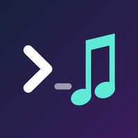

<div align="center">



# cmusic

**Nhạc nền cho Claude Code.**<br>
Bảo Claude mở bài nào, nhạc phát luôn trong lúc bạn code.

[](LICENSE)


[English](README.md) · **Tiếng Việt**

</div>

---

```
> /music Nơi này có anh
▶ NƠI NÀY CÓ ANH | OFFICIAL MUSIC VIDEO | SƠN TÙNG M-TP

> /music
Debug lâu rồi, mình bật lo-fi cho bạn tập trung nhé.
▶ lofi hip hop mix 📚 beats to relax/study to

> qua bài khác đi, nhỏ tiếng chút
⏭ Best of lofi hip hop 2021 ✨ [beats to relax/study to]
🔊 40
```

## ✨ Tính năng

- 🎧 **Phát theo tên bài.** Gõ tên bài hoặc ca sĩ là nhạc phát từ YouTube. Bạn cũng có thể dán link YouTube hoặc SoundCloud.
- 🧠 **Claude chọn nhạc giúp bạn.** Muốn nghe gì hợp mood, hay cần nhạc để tập trung, cứ bảo Claude.
- 📜 **Hàng đợi và điều khiển.** Thêm bài vào hàng đợi, tạm dừng, qua bài, chỉnh âm lượng, bằng lệnh hoặc nói tự nhiên.
- 🔒 **Không cần đăng ký gì.** Không tài khoản, không API key, không lưu file nào xuống ổ cứng.

## 🚀 Cài đặt

```
/plugin marketplace add tungnt1203/cmusic
/plugin install cmusic@cmusic
```

Sau đó khởi động lại Claude Code. Lần đầu phát nhạc, Claude sẽ tự cài `mpv` và `yt-dlp`.

> [!NOTE]
> Chạy được trên Claude Code ở **macOS** và **Linux** (Windows thì dùng WSL). Không dùng được trên claude.ai hay app điện thoại, vì ở đó không phát được tiếng ra máy tính của bạn.

<details>
<summary>Muốn dùng lệnh ngắn <code>/music</code>? Cài dạng skill cá nhân</summary>

```bash
git clone https://github.com/tungnt1203/cmusic
cp -r cmusic/skills/music ~/.claude/skills/
```

</details>

## 🎛️ Cách dùng

| Lệnh | Tác dụng |
|---|---|
| `/music <tên bài>` | Phát bài theo tên, hoặc phát từ link |
| `/music` | Để Claude tự chọn theo mood |
| `/music add <tên bài>` | Thêm vào hàng đợi |
| `/music queue` | Xem hàng đợi (`remove 2`, `clear` để sửa) |
| `/music pause` · `next` · `prev` · `stop` | Điều khiển phát nhạc |
| `/music seek +30` · `seek 1:30` · `replay` | Tua trong bài |
| `/music vol 40` | Chỉnh âm lượng (0–100) |
| `/music now` | Xem đang phát bài gì |
| `/music stop in 30m` | Hẹn giờ tắt nhạc, nhỏ dần rồi tắt (`stop after this`: tắt khi hết bài) |

<details>
<summary>Hiện bài đang phát trên statusline</summary>

Nhờ Claude *"hiện nhạc lên statusline"*, hoặc thêm vào `~/.claude/settings.json`:

```json
"statusLine": {
  "type": "command",
  "command": "\"$(ls -td ~/.claude/plugins/cache/cmusic/cmusic/*/ | head -1)bin/cmusic\" now --line"
}
```

Nó in ra `♪ Nơi này có anh · 1:23/4:10` (`⏸` khi tạm dừng) và không in gì khi không có nhạc. Đã có statusline riêng? Nối thêm output của lệnh trên vào statusline của bạn. `cmusic statusline` in ra đúng lệnh cho cách cài của bạn.

</details>

Khi cài dạng plugin, lệnh sẽ là `/cmusic:music`. Cũng có thể nói tự nhiên: *"bật nhạc lo-fi đi"*, *"tắt nhạc"*.

## 🔍 Plugin chạy những gì

Mọi thứ chạy trên máy bạn, qua một script shell, [`skills/music/scripts/music.sh`](skills/music/scripts/music.sh), và một script Lua nhỏ chạy trong mpv, [`cmusic.lua`](skills/music/scripts/cmusic.lua), để fade âm lượng và hẹn giờ.

| | |
|---|---|
| **Phát nhạc** | [`mpv`](https://mpv.io) stream tiếng thông qua [`yt-dlp`](https://github.com/yt-dlp/yt-dlp), và được điều khiển qua một socket nằm trong thư mục tạm trên máy |
| **Cài đặt** | Chỉ chạy khi máy còn thiếu tool. macOS: `brew install mpv yt-dlp`. Linux: `pipx install yt-dlp` nếu máy có pipx, còn mpv (và yt-dlp nếu không có pipx) thì cài từ apt, dnf, pacman, zypper hoặc apk qua `sudo` |
| **Kết nối mạng** | Chỉ tới YouTube hoặc link bạn đưa, và tới nguồn cài gói (Homebrew, PyPI, mirror của distro) khi cài đặt. Không thu thập dữ liệu sử dụng |

## ❓ Hỏi đáp

<details>
<summary><b>Có tải nhạc về máy không?</b></summary>

Không. Nhạc chỉ stream qua RAM, không lưu file nào xuống ổ cứng.

</details>

<details>
<summary><b>Bài không phát được?</b></summary>

YouTube hay thay đổi, nên update yt-dlp: `brew upgrade yt-dlp` trên macOS, hoặc `pipx upgrade yt-dlp` trên Linux.

</details>

---

<div align="center">

MIT License · [Quyền riêng tư](PRIVACY.md) · [Hỗ trợ](https://github.com/tungnt1203/cmusic/issues) · tung.nguyen120301@gmail.com<br>
Dự án cộng đồng, không liên kết với Anthropic

</div>
